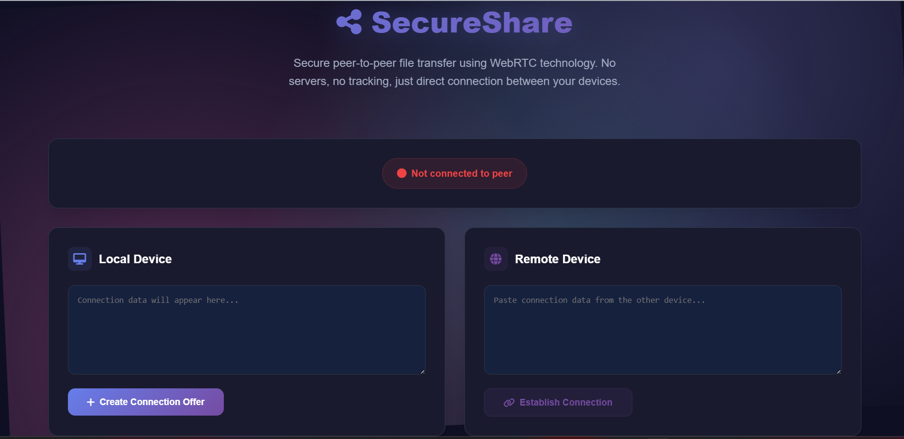

# DropBridge – A WebRTC-Based P2P File Transfer Tool

[](https://developer.mozilla.org/en-US/docs/Web)
[]()
[](LICENSE)

Welcome to **DropBridge**, a secure and efficient web application for peer-to-peer (P2P) file transfers, powered by **WebRTC**. This project provides a direct, browser-to-browser connection, eliminating the need for intermediary servers to transfer your files. Whether you're sharing documents, images, or any other data, DropBridge ensures your files go straight from sender to receiver, offering enhanced privacy and speed. It's an excellent showcase for understanding real-time communication and data channels in web development.

---

## 📑 Table of Contents

- [🚀 Features](#-features)
- [⚙ How It Works](#-how-it-works)
- [🧠 Concepts Covered](#-concepts-covered)
- [📂 Project Structure](#-project-structure)
- [📷 Screenshots](#-screenshots)
- [📦 Technologies Used](#-technologies-used)
- [💻 Getting Started](#-getting-started)
- [📄 License](#-license)
- [📬 Contact](#-contact)

---

## 🚀 Features

✅ Direct Peer-to-Peer file transfer using WebRTC   
🔒 Secure and private data exchange   
🚀 Fast transfers, bypassing traditional server uploads   
🌐 Cross-browser compatibility   
📱 Responsive UI for desktop and mobile   
👨‍🏫 Beginner-friendly structure for WebRTC learning   
🧩 Ideal for exploring real-time communication in browsers

---

## ⚙ How It Works

1.  **Signaling:** Users initiate a connection through a signaling server (not for data transfer, but for exchanging connection information like IP addresses and port numbers). This typically involves WebSocket for real-time communication.
2.  **Peer Connection (RTCPeerConnection):** Once signaling is complete, browsers establish a direct P2P connection using WebRTC's `RTCPeerConnection` API.
3.  **Data Channel (RTCDataChannel):** Files are transferred over a secure `RTCDataChannel` established within the peer connection. This channel allows for reliable, high-throughput data transfer.
4.  **File Transfer:** The sender selects a file, which is then chunked and sent over the data channel to the receiver. The receiver reconstructs the file.
5.  The entire process leverages vanilla JavaScript for core logic, HTML for structure, and CSS for styling and responsiveness.

---

## 🧠 Concepts Covered

This project is excellent for understanding and practicing:

-   ✅ **WebRTC Fundamentals:** `RTCPeerConnection`, `RTCSessionDescription`, `RTCIceCandidate`
-   **RTCDataChannel API:** Sending and receiving arbitrary data over a P2P connection
-   **Signaling Mechanisms:** How peers discover and connect with each other (requires an external signaling server setup, e.g., using WebSockets)
-   **File API:** Reading and handling files in the browser
-   **Blob and ArrayBuffer:** Efficiently handling binary data for transfer
-   **Asynchronous JavaScript:** Managing promises and callbacks for WebRTC events
-   **DOM Manipulation:** Dynamically updating the UI to reflect connection status and transfer progress
-   **Basic HTML Structure and Semantics**
-   **CSS Styling, Alignment, and Layout Techniques**
-   **Responsive Web Design**

---

## 📂 Project Structure


---

## 📷 Screenshots

### 🔗 Initial State
Images/photo.png

### ✉️ Connection Offer Generated


### ✅ Peer Connection Established


### 📤 Ready for File Transfer


### ⬇️ File Successfully Received


> _The images above are hosted externally for demonstration. In your repository, you might place them in a `/screenshots` folder and update the paths accordingly._

---

## 📦 Technologies Used

| Technology    | Description                                   |
|---------------|-----------------------------------------------|
| 🧱 **HTML5** | Page structure and content.                   |
| 🎨 **CSS3** | Layout, fonts, images, and responsiveness.    |
| ⚙ **JavaScript** | Dynamic functionality, WebRTC logic, and interactivity. |
| 🚀 **WebRTC** | Peer-to-peer communication for file transfer. |
| 🔌 **WebSockets** | (Likely for Signaling Server) Real-time communication for connection setup. |

---

## 💻 Getting Started

Follow these steps to get DropBridge running on your local machine. Please note that a **signaling server is required** for WebRTC connections to be established. This project focuses on the client-side WebRTC implementation; you'll need to set up or use an existing signaling server.

### 🔧 Prerequisites

-   A modern web browser (Chrome, Firefox, Edge, etc.)
-   Basic understanding of HTML/CSS/JS (recommended)
-   **A signaling server running and accessible** (e.g., a simple WebSocket server). You'll need to configure `script.js` to point to your signaling server's address.

### 💻 Getting Started

Follow these steps to get DropBridge running on your local machine. Please note that a **signaling server is required** for WebRTC connections to be established. This project focuses on the client-side WebRTC implementation; you'll need to set up or use an existing signaling server.

#### 🔧 Prerequisites

-   A modern web browser (Chrome, Firefox, Edge, etc.)
-   Basic understanding of HTML/CSS/JS (recommended)
-   Node.js and npm installed (for the signaling server)

#### 🚀 Installation

1.  *Clone the repository:*

    ```bash
    git clone [https://github.com/SurajKulal1/DropBridge-A-WebRTC-Based-P2P-File-Transfer-Tool.git](https://github.com/SurajKulal1/DropBridge-A-WebRTC-Based-P2P-File-Transfer-Tool.git)
    ```

2.  *Navigate to the project directory:*

    ```bash
    cd DropBridge-A-WebRTC-Based-P2P-File-Transfer-Tool
    ```

3.  *Install server dependencies and run the signaling server:*

    ```bash
    cd server
    npm install
    npm start
    ```
    *(This starts the signaling server, typically on `http://localhost:3000/`.)*

4.  *Update signaling server URL (Client-Side):*
    Open your `script.js` file (or wherever the WebSocket is initialized on the client-side, likely in your main `DropBridge-A-WebRTC-Based-P2P-File-Transfer-Tool/script.js` file) and ensure the server URL matches where your signaling server is running:

    ```javascript
    const signalingServerUrl = 'http://localhost:3000/'; // Or your deployed server URL
    const ws = new WebSocket(signalingServerUrl);
    ```
    

## 📄 License

This project is licensed under the [MIT License](LICENSE). You are free to use, modify, and distribute it for personal and commercial purposes.

---

## 📬 Contact

[Suraj Kulal](https://github.com/SurajKulal1)

Have suggestions, questions, or want to collaborate? Feel free to open an issue or pull request!

---

> 💡 Don't forget to ⭐ star the repo if you found it helpful!
